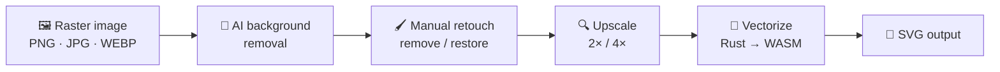

<div align="center">

# 🎨 HaidarApp

### Turn any raster image into clean, scalable SVG — right in your browser.

**AI background removal · manual retouch · upscaling · true-color & B/W vectorization · bulk processing**

[](https://haidaresber.github.io/haidarsvg/)

[](#-license)


<sub>Created by **Haidar Esber** — Lebanese software developer based in France 🇱🇧🇫🇷</sub>

</div>

---

## What is HaidarApp?

HaidarApp is a **fully client-side raster → vector pipeline**. Drop in a `PNG`, `JPG`, or
`WEBP`, optionally strip the background with an in-browser AI model, retouch and upscale it,
then trace it to a crisp `SVG` — all without uploading a single byte to a server. The heavy
lifting (vectorization) runs in a Rust engine compiled to **WebAssembly**; background removal
runs on **ONNX Runtime Web**.

> **No install, no account, no upload.** Everything runs in your browser tab.
> 👉 **[Try the live demo](https://haidaresber.github.io/haidarsvg/)**

## The pipeline



Every stage is optional except the last — jump straight to vectorization, or run the whole chain.

## Features

| | Feature | Details |
|---|---|---|
| 🎨 | **AI background removal** | `@imgly/background-removal` (`isnet_fp16` model on ONNX Runtime Web), plus a residue-cleanup pass that removes low-alpha "ghost" pixels |
| 🖌️ | **Manual retouch** | Brush-based remove/restore to fix edges the model missed, with adjustable brush size |
| 🔍 | **Upscaling** | 2× / 4× high-quality canvas resampling to recover detail before tracing |
| 🔄 | **True-color vectorization** | Incremental clustering → many colored `<path>` layers; stacked or cutout hierarchy |
| ⬛ | **B/W vectorization** | Threshold to a binary image and trace filled shapes |
| 🫥 | **Transparency-aware** | Uses a discarded "key color" so transparent regions survive into the SVG |
| 💾 | **Flexible export** | Download as **SVG**, **PNG**, or a background-free raster |
| 📦 | **Bulk mode** | Batch up to **50** images through the full pipeline and download a single **ZIP** |

### Bulk workflow

The bulk page (`bulk.html`) runs each image through a fixed pipeline and zips the results:

```
📤 Upload  →  🔍 Upscale 2×  →  🎨 Remove BG  →  🔄 Vectorize  →  📸 SVG→JPEG  →  📦 ZIP
```

## Repository layout

This repo contains three ways to use the same vectorization core:

| Path | What it is | Best for |
|---|---|---|
| [`HaidarApp/`](HaidarApp/) | The full web app (single-image UI + bulk page) | End users — the complete pipeline |
| [`webapp/`](webapp/) | A minimal browser demo of the tracer | Learning / embedding the core |
| [`cmdapp/`](cmdapp/) | The `vtracer` command-line tool | Scripting & batch automation |

## Getting started

### Option 1 — Just use it (recommended)

No setup required. Open the hosted app:

**→ https://haidaresber.github.io/haidarsvg/**

### Option 2 — Run the web app locally

**Prerequisites:** [Rust](https://www.rust-lang.org/tools/install) (with the
`wasm32-unknown-unknown` target), [`wasm-pack`](https://rustwasm.github.io/wasm-pack/), and
[Node.js](https://nodejs.org/) + npm. See [`HaidarApp/INSTALL.md`](HaidarApp/INSTALL.md) for
detailed setup and troubleshooting.

```bash
cd HaidarApp
./build.sh          # builds the WASM package into app/www/pkg and installs npm deps
cd app/www
npm start
```

Then open <http://localhost:8080>. The bulk page is at `bulk.html`.

<details>
<summary>Manual build (without <code>build.sh</code>)</summary>

```bash
cd HaidarApp/app
wasm-pack build --target web --out-dir www/pkg
cd www
npm install
npm start          # or: npm run build  (production bundle)
```
</details>

### Option 3 — Command-line (`vtracer`)

```bash
# Run straight from the workspace
cargo run --release -p vtracer -- --input input.png --output output.svg

# …or install the binary
cargo install --path cmdapp
vtracer --input input.png --output output.svg --preset photo
```

## Tuning the tracer

Both the UI and CLI expose the same knobs. Sensible presets (`bw`, `poster`, `photo`) cover
most cases; reach for the individual parameters when you need finer control.

| Parameter | What it does |
|---|---|
| `colormode` | `color` (true color) or `bw` (binary) |
| `hierarchical` | `stacked` (layers overlap) or `cutout` (disjoint shapes) — color mode only |
| `mode` | Curve fitting: `pixel` · `polygon` · `spline` |
| `filter_speckle` | Discard patches smaller than *N* px (denoise) |
| `color_precision` | Significant bits per RGB channel |
| `gradient_step` / `layer_difference` | Color distance between layers |
| `corner_threshold` | Minimum angle (°) to count as a corner |
| `segment_length` | Subdivide-and-smooth until segments are shorter than *N* |
| `splice_threshold` | Minimum angle (°) to splice a spline |
| `path_precision` | Decimal places in path coordinates |

<details>
<summary>Full CLI reference</summary>

```
vtracer [OPTIONS] --input <input> --output <output>

    --colormode <color_mode>            color (default) | bw
    --hierarchical <hierarchical>       stacked (default) | cutout   (color mode)
-m, --mode <mode>                       pixel | polygon | spline
-p, --color_precision <n>               significant bits per RGB channel
-f, --filter_speckle <n>                discard patches smaller than n px
-c, --corner_threshold <deg>            minimum corner angle
-l, --segment_length <n>                subdivide-smooth to segments < n
-s, --splice_threshold <deg>            minimum splice angle
-g, --gradient_step <n>                 color diff between gradient layers
    --path_precision <n>                decimal places in path strings
    --preset <preset>                   bw | poster | photo
-i, --input <path>                      input raster image
-o, --output <path>                     output SVG
```
</details>

## How it works

- **Vectorization core** — a Rust engine (VTracer lineage) exposing `ColorImageConverter` and
  `BinaryImageConverter`, compiled to WebAssembly with `wasm-bindgen`. It clusters pixels,
  fits curves, and writes `<path>` elements directly into the target `<svg>`.
- **Background removal** — `@imgly/background-removal` runs the `isnet_fp16` segmentation model
  via ONNX Runtime Web; the model is fetched once and cached, then works offline.
- **Everything is local** — images never leave the browser; there is no backend.

## Tech stack

**Rust** · **WebAssembly** (`wasm-bindgen`, `web-sys`) · **visioncortex / VTracer** ·
**ONNX Runtime Web** (`@imgly/background-removal`) · **JSZip** · **webpack**

## Credits

Built on excellent open-source work:

- **[VTracer](https://github.com/visioncortex/vtracer)** & **[visioncortex](https://github.com/visioncortex/visioncortex)** — the Rust tracing + clustering foundation
- **[`@imgly/background-removal`](https://github.com/imgly/background-removal-js)** — in-browser AI background removal (ONNX Runtime Web)
- **[JSZip](https://stuk.github.io/jszip/)** — ZIP bundling for bulk exports
- **[webpack](https://webpack.js.org/)** — bundling & dev server

## 🪪 License

Dual-licensed under **MIT OR Apache-2.0** — see [`LICENSE-MIT`](LICENSE-MIT) and
[`LICENSE-APACHE`](LICENSE-APACHE). Third-party dependencies retain their own licenses.
